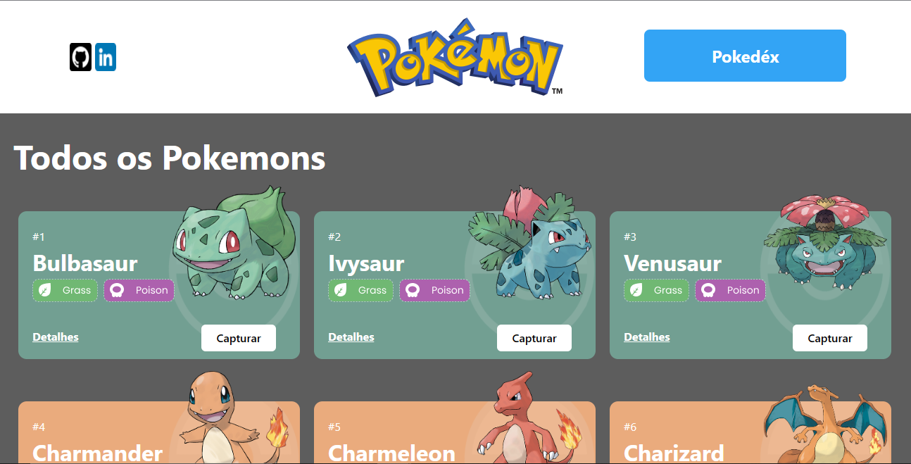

# # Projeto React e API's Pokedex

O Projeto React e APIs, é um site de pokémons que possui três páginas: Home, Pokedex e Detalhes. 
É objetivo deste projeto criar um site usando como fonte de dados a Poke Api

#
## Stack utilizada: Front-end: 
Integração de APIs

React Router

Design Systems

Estado Global

Requisições com Axios 

## Como rodar este projeto?

### clone este repositório
$ git clone https://github.com/myllenavieira/projeto-react-apis.git

### Acesse a pasta do projeto no seu terminal
$ cd projeto-react-apis

### Instale as dependências
$ npm install

### Execute a aplicação
$ npm run start

